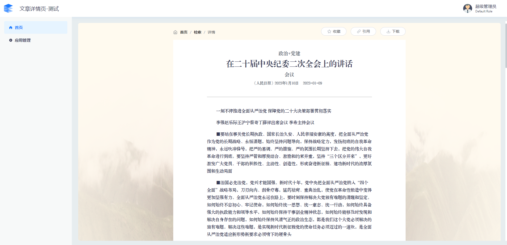

## 组件预览


### 插件概述

数睿开放平台的 UI 插件为用户提供应用设计、分析仪、大屏、填报设计等核心模块自定义前端组件的能力。用户运用此能力，可以定制 UI 样式和页面逻辑。

框架集成了以下的功能：

+ 本地编辑开发，支持可视化预览。
+ 集成打包命令 npm run plugin ，支持一键打包。
+ 支持css / less / scss 语言。
+ 内置AntD(AntD是一款企业级的UI设计语言和React UI类库)。
+ 接口封装，使用proxy 方式代理接口，调用支持开发请求代理。

### 开发前准备

scli方式
    1. 本地运行cmd命令，打开运行窗口。
    2. 执行以下命令全局安装sdata-cli服务。

  ```js
    npm i sdata-cli -g
  ```
    3. 安装完成后，运行scli i，选择对应模块及框架
    4. npm i或者yarn install安装相关依赖项，运行npm run serve(Vue版本)/npm run start(React版本)即可开始进行开发

### 插件包文件说明

| 文件名 | 说明                                                                                                                               |
| --- |----------------------------------------------------------------------------------------------------------------------------------|
| config | config文件下内容Webpack 的编译配置，不建议修改。                                                                                                  |
| pluginTemp | 用于存放模板文件， config.json 文件用于配置插件参数，其他文件不建议修改。                                                                                      |
| public | public目录下是一些静态文件，不建议修改。                                                                                                          |
| scripts | scripts目录下是开发服务器启动和打包脚本，一般不需要改动。                                                                                                 |
| src | src 目录下是插件的源码，用户在此目录下开发定制代码。                                                                                                     |
| src/api | src/api下的文件是接口层，可以添加自己需要的Http 接口。                                                                                                |
### config.json配置文件字段说明

| 参数      | 参数说明                                                                                            |
|---------|-------------------------------------------------------------------------------------------------|
| id      | 插件标识，用户在下载插件模板时，系统自动生成，用户无需自定义。                                                                 |
| type    | 开发插件类型|
| main    | 插件打包后生成的上级JS文件名，插件打包时会自动更新此参数，用户无需手动配置。                                  |
| version | 标识插件的版本，目前默认取值为“2”。                                                                             |
| props   | 传递插件自定义相关属性。不同模块的自定义属性不同,请参见数据交互章节讲解。                                                           |

### 远程调试

+ react版本
    1. 修改proxy.js的target字段为代理地址
    2. 修改src/api/request.js中document.cookie的token和refreshToken字段为代理地址请求头的相应字段
    3. npm run start
+ vue版本
    1. 修改vue.config.js的target字段为代理地址，
    2. 修改src/api/request.js中document.cookie的token和refreshToken字段为代理地址请求头的相应字段
    3. npm run serve


### 插件上传

1. 登录数睿平台，单击“开放平台”，进入开放平台页面。
   

2. 单击“插件开发”，进入插件开发页面。
   
3. 单击“我的插件”，进入插件列表页面。
   
4. 单击“新增插件”，新增插件弹窗弹出。
   

5. 在新增插件弹窗中，输入插件信息。
   

| 参数 | 参数说明 |
| --- | --- |
| 插件名称 | 插件名称。 |
| 插件类型 | 在下拉列表中选择相应的组件类型。 |
| 存储目录 | 选择插件的存放目录。 |
| 是否启动 | 插件是否启动生效。只有设置为“启用”是，插件才可被使用。 |
| 前端插件包 | 在本地选择需要上传的前端插件包。 |
| 图标 | 单击“选择图标”，根据需要选择面性或线性类型的图标，并且可以通过配置主题颜色，配置图标的颜色。也可以选择自定义，上传自定义图标，支持的自定义图标格式有jpg、jpeg、png、bmp和svg，且图片的大小不能超过128K。 |

### 功能验证

+ 上传二开插件包到验证环境上，写入对应的配置字段即可。基本的功能验证与本地调试基本一致
+ events的验证，需要点到二开组件的交互界面，点击相应事件名，添加相应的打印输出逻辑，即可判断事件是否已经接入smardaten平台
+ actions验证，可搭建最简单的场景，如一个按钮，点击事件触发对应的动作，看能否正常生效即可。

### 其他注意事项（开发过程中务必关注）

+ 在组件的模板中，预置了一些事件动作相关的函数及定义，请在正式开发中将$\color{red}{用不到的事件与动作清除掉}$，并正确书写`Event_Center_getName`函数的返回值，以防止对配置人员造成困扰。
+ 二开组件代码中，如果需要获取dom元素并进行操作，react版本或vue版本都应通过ref去获取dom元素而非通过选择器，以防止组件复用时造成冲突
